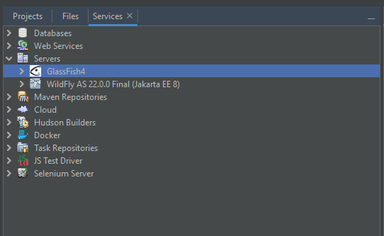
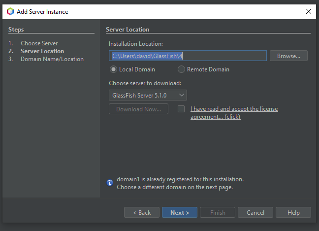
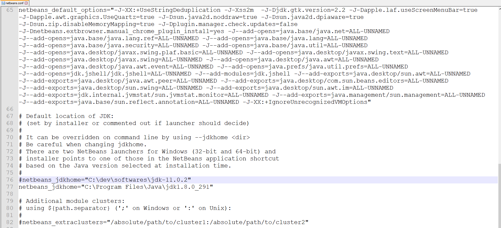
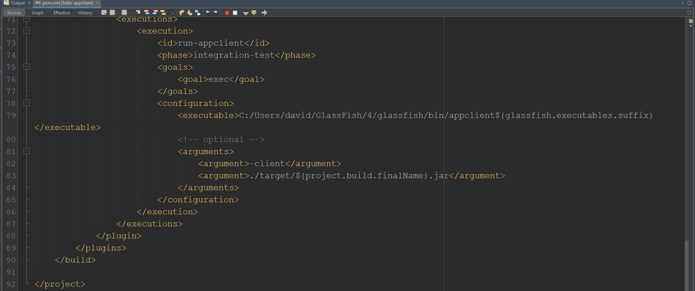

# seminario-webdev

# Sumário
1. [Sobre](#sobre)

2. [Configurando o projeto](#configurando-o-projeto)

# Sobre
Esse repositório contém os arquivos usados durante a apresentação do seminário sobre JAX-WS pela equipe Anne Caroline P. Santos, David Jansen e Eike Stálei.
O seminário é parte das atividades requeridas na disciplina de Desenvolvimento Web, ministrada pelo Professor Luis Guisso, e ofertada pelo Instituto Federal do Norte de Minas Ferais (IFNMG) na modalidade ANP.
Os arquivos aqui contidos foram retirados do tutorial oficial da Oracle que não se encontra mais online. Sendo assim, anexamos um modelo offline do tutorial em nosso repositório, referente ao tema JAX-WS. Ressaltamos que nenhum conteúdo da documentação foi alterado.

Localização específica do projeto para nosso tema: [projeto do seminário](https://github.com/DWalterJansen/seminario-webdev/tree/main/jakartaee-tutorial-examples-master/jaxws)

Link para vídeo com explicação: https://youtu.be/mZHcTZtnoK0

# Configurando o projeto
    - Para esse projeto é importante ter o GlassFish na versão 4.1 configuração no seu netbeans.
    - Também é necessário utilizar o JDK na versão 8.

## Instalando o GlassFish 4.1
1 - No Netbeans, acesse a aba *Services* e sobre *server* clique com botão direito e adicione novo server

2 - O próximo passo é escolher onde será feito o download do glassfish. Lembre de escolher a versão 4.1, independente da 5.1 ser mais nova.

## Configuração do JDK 8
1 - Após realizar o download da versão do JDK 8, configure o NetBeans para utilizar essa versão através do *netbeans.conf*. Abaixo segue um exemplo de como mudar o valor do jdk utilizado.

> [!IMPORTANT]
> Esse processo dever ser feito com o Netbeans fechado

### Solução para bugs comuns
1 - Certifique-se de que o service rodou antes de executar qualquer um dos clientes.

2 - Utilize o GlassFish na versão indicada acima e o JDK na versão 8.

3 - Crie os projetos em diretórios próximos da raiz para não correr risco de pastas longas com acentuação.

4 - Se mesmo assim ocorrer um erro onde o app client não encontra o glassfish, passe o caminho do glassfish manualmente no pom.xml.

